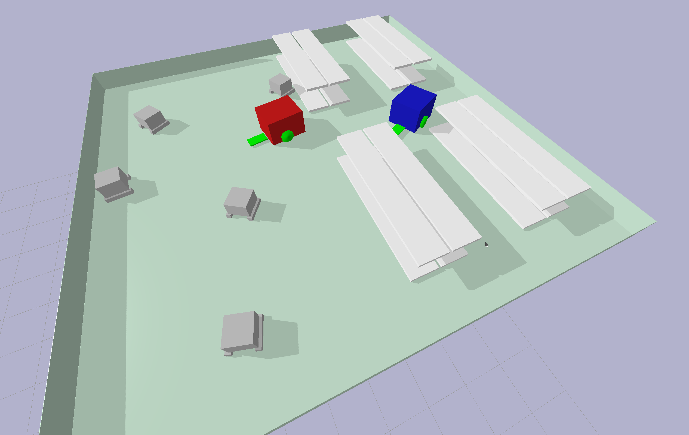

 
# Warehouse

In Warehouse environment, agents must collect boxes and put them to shelves.
RL algorithm - multi-agent A2C

Current project state: agents learning to pick a box [(youtube example)](https://www.youtube.com/watch?v=CfSFrVDrzXw).
